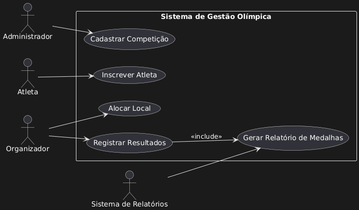
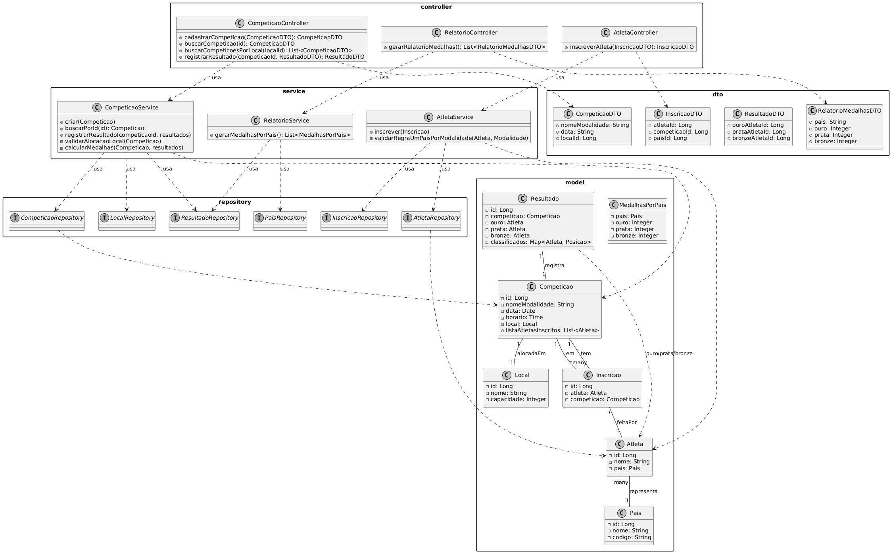
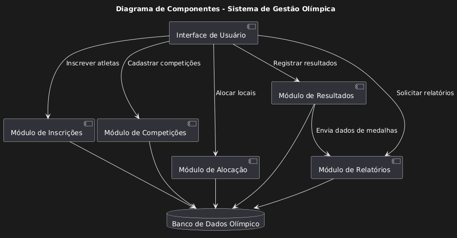
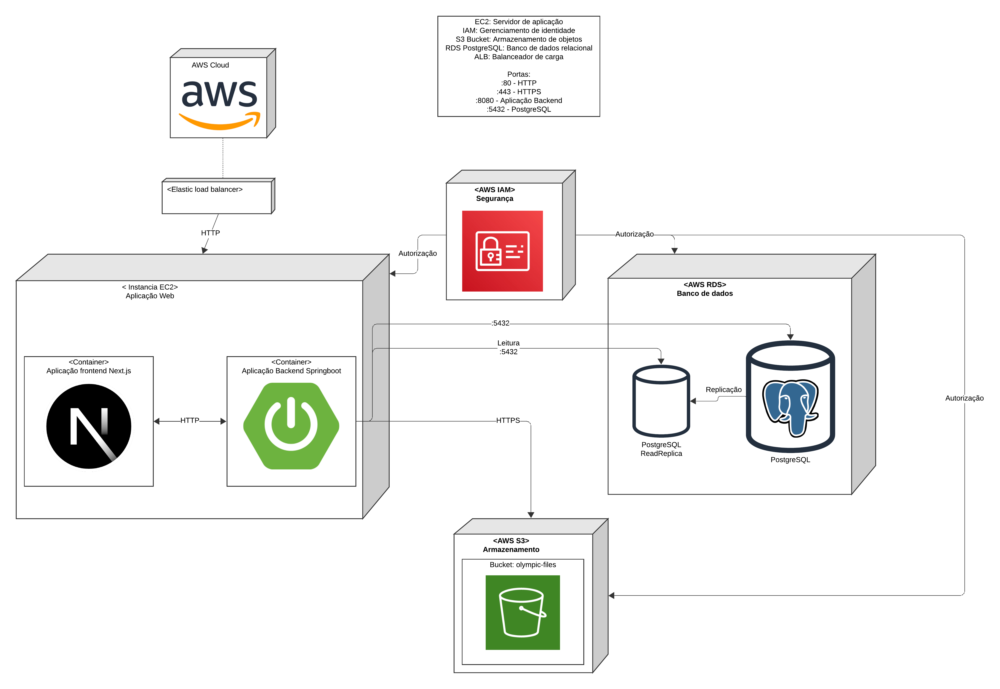

# Sistema de Gestão de Olimpíadas

## Descrição do Projeto

Com a chegada das Olimpíadas, um novo sistema de gestão é necessário para coordenar os diferentes aspectos do evento. Este sistema deve permitir o gerenciamento de competições, inscrições de atletas, alocação de locais para as provas, e controle de resultados.

## Funcionalidades Principais

### 1. Cadastro de Competições
- O sistema permite o cadastro de competições, incluindo:
  - Nome da modalidade
  - Data e horário
  - Local de realização
  - Lista de atletas inscritos

### 2. Inscrição de Atletas
- Atletas de diferentes países podem se inscrever em competições específicas
- Cada atleta pode participar de várias competições
- Um atleta só pode representar um país por modalidade

### 3. Alocação de Locais
- Os locais para as competições são alocados evitando conflitos de horário
- Um local só pode abrigar uma competição por vez

### 4. Controle de Resultados
- Após a realização das competições, os resultados são registrados
- Sistema determina o atleta vencedor e os classificados em segundo e terceiro lugares

### 5. Relatórios de Medalhas
- O sistema gera relatórios de medalhas por país
- Mostra o desempenho baseado nas medalhas de ouro, prata e bronze conquistadas

## Arquitetura do Sistema

### Diagrama de Casos de Uso
Este diagrama ilustra as principais interações entre os usuários do sistema e as funcionalidades disponíveis.

### Diagrama de Classes e Pacotes
Este diagrama apresenta a estrutura interna do sistema, mostrando as classes, pacotes e seus relacionamentos.

### Diagrama de Componentes
Este diagrama mostra a arquitetura de componentes do sistema e como eles se relacionam.

### Diagrama de Implantação
Este diagrama representa como o sistema será implantado em ambiente de produção.

## Estrutura de Pacotes

O sistema está organizado nos seguintes pacotes principais:

- **Controller**: Responsável pela camada de apresentação e controle das requisições
- **Service**: Contém a lógica de negócio do sistema
- **Repository**: Interface para acesso aos dados
- **Model**: Entidades do domínio
- **DTO**: Objetos de transferência de dados

## Entidades Principais

### Competição
- Representa uma modalidade esportiva específica
- Contém informações sobre data, horário, local e atletas inscritos

### Atleta
- Representa um competidor
- Possui nome e país de origem

### País
- Representa as nações participantes
- Contém nome e código do país

### Local
- Representa os locais onde as competições ocorrem
- Possui nome e capacidade

### Resultado
- Registra os resultados de uma competição
- Define atletas vencedores (ouro, prata, bronze)

## Histórias de Usuário

### US01: Cadastro de Competições
**Como** organizador das Olimpíadas  
**Eu quero** cadastrar novas competições no sistema  
**Para que** eu possa organizar e gerenciar todas as modalidades esportivas do evento

**Critérios de Aceitação:**
- Devo poder inserir nome da modalidade, data, horário e local
- O sistema deve validar se o local está disponível no horário solicitado
- Devo receber confirmação do cadastro bem-sucedido
- O sistema deve impedir conflitos de horário no mesmo local

### US02: Inscrição de Atletas
**Como** atleta participante  
**Eu quero** me inscrever em competições específicas  
**Para que** eu possa participar das modalidades esportivas das Olimpíadas

**Critérios de Aceitação:**
- Devo poder selecionar a competição desejada
- O sistema deve validar se represento apenas um país por modalidade
- Devo poder me inscrever em múltiplas competições
- O sistema deve confirmar minha inscrição

### US03: Geração de Relatórios de Medalhas
**Como** organizador das Olimpíadas  
**Eu quero** gerar relatórios de medalhas por país  
**Para que** eu possa acompanhar o desempenho das nações participantes

**Critérios de Aceitação:**
- O relatório deve mostrar medalhas de ouro, prata e bronze por país
- Devo poder visualizar o ranking geral de países
- O relatório deve ser atualizado automaticamente após cada competição
- Devo poder exportar o relatório em formato PDF

## Regras de Negócio

1. **Cadastro de competições**: Sistema deve permitir cadastro completo com validações de data e local
2. **Inscrição de atletas**: Validação de que cada atleta representa apenas um país por modalidade
3. **Alocação de locais**: Prevenção de conflitos de horário entre competições
4. **Controle de resultados**: Registro obrigatório de posições dos atletas
5. **Relatórios de medalhas**: Geração automática de estatísticas por país

## Tecnologias Utilizadas

- **PlantUML**: Para modelagem dos diagramas
- **Arquitetura em Camadas**: Separação clara de responsabilidades
- **LucidChart**: Para modelagem do diagrama de implantação 

## Contribuição

Este projeto foi desenvolvido como parte de um trabalho acadêmico sobre modelagem de sistemas. Para contribuições, entre em contato com os desenvolvedores.

## Licença

Este projeto está sob licença acadêmica. Consulte o arquivo de licença para mais detalhes.

---

**Desenvolvido para o Sistema de Gestão de Olimpíadas**